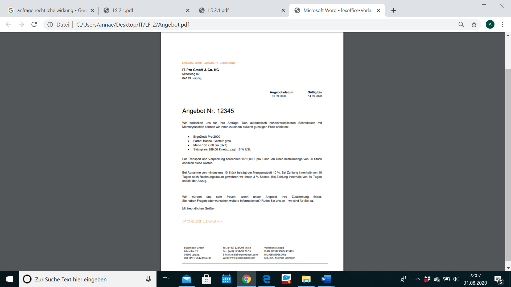

[Lernfeld 2: Arbeitsplätze nach Kundenwunsch ausstatten IT]{.ul}

<table>
<thead>
<tr class="header">
<th>
LS1:

Kundenbedarf
</th>
<th></th>
<th>
LS2: Angebote

vergleichen
</th>
<th></th>
<th>
LS3: Kaufvertrag

abschließen
</th>
<th></th>
<th>
LS4:

Wareneingang
</th>
<th></th>
<th><blockquote>

LS5: Übergabe durchführen

</blockquote></th>
<th></th>
<th>
LS6:

Durchführung
</th>
</tr>
</thead>
<tbody>
<tr class="odd">
<td></td>
<td></td>
<td></td>
<td></td>
<td></td>
<td></td>
<td></td>
<td></td>
<td></td>
<td></td>
<td>des</td>
</tr>
<tr class="even">
<td>ermitteln</td>
<td></td>
<td></td>
<td></td>
<td></td>
<td></td>
<td>bearbeiten</td>
<td></td>
<td></td>
<td></td>
<td>
Kundenauftrags

reflektieren
</td>
</tr>
</tbody>
</table>

+----------------------------------------------------------------------+
| > **Lernsituation 2: Angebote vergleichen**\                         |
| > **Ausgangssituation:**\                                            |
| > Sie sind Mitarbeiter eines IT-Systemhauses in der Leipziger        |
| > Innenstadt. Zu Ihren Kunden zählen kleine sowie mittelständische   |
| > Unternehmen vornehmlich aus der Region Leipzig/Halle, aber auch    |
| > aus dem gesamten Bundesgebiet. Ihr Unternehmen berät die Kunden,   |
| > entwickelt IT-Lösungen, beschafft die erforderlichen Produkte und  |
| > richtet diese beim Kunden ein.                                     |
| >                                                                    |
| > Ihnen liegt die Anfrage eines Architekturbüros vor, das die        |
| > Büroarbeitsplätze seiner 10 Mitarbeiter grundlegend neugestalten   |
| > möchte. Der Kunde möchte die Hardware auf den neusten              |
| > technologischen Stand bringen sowie agile und flexible             |
| > Arbeitsmöglichkeiten fördern. Da dem Kunden die Gesundheit seiner  |
| > Mitarbeiter besonders am Herzen liegt, soll außerdem die Ergonomie |
| > am Arbeitsplatz optimiert werden.                                  |
+----------------------------------------------------------------------+

> **[Arbeitsauftrag 1 (Bezugsquellenermittlung):]{.ul}**\
> Um die Gesundheit der Mitarbeiter zu schonen und eine angenehme
> Arbeitsatmosphäre zu schaffen, möchte die Geschäftsleitung des
> Architekturbüros die Arbeitsplätze mit 10 elektrisch verstellbaren
> Bürotischen und 10 Drehstühlen mit Lordosenstütze ausstatten.
>
> Suchen Sie online nach 3 Lieferanten in Leipzig und Umgebung, die
> Bürostühle liefern. Dazu können Sie neben klassischen Suchmaschinen
> auch die Gelben Seiten ([www.gelbeseiten.de]{.ul}) und die
> Lieferantensuchmaschine „Wer liefert was" ([www.wlw.de]{.ul}) nutzen.
> Notiere die Firmennamen mit Geschäftssitz hier:\
> 1. \_\_\_\_\_\_\_\_\_\_\_\_\_\_\_\_\_\_\_\_\_\_\_\_\_\_\_\_\_ 2.
> \_\_\_\_\_\_\_\_\_\_\_\_\_\_\_\_\_\_\_\_\_\_\_\_\_\_\_\_ 3.
> \_\_\_\_\_\_\_\_\_\_\_\_\_\_\_\_\_\_\_\_\_\_\_\_\_\_\_\_\_\_
>
> Um mögliche Lieferanten für die benötigten Waren in Erfahrung zu
> bringen, stehen Unternehmen interne und externe Informationsquellen
> zur Verfügung.

+----------------------+----------------------+----------------------+
| {width="1.125in" |                      | image7.png){width="1 |
| height="0.           |                      | .0416666666666667in" |
| 7916666666666666in"} |                      | > height="0.         |
|                      |                      | 8055555555555556in"} |
+======================+======================+======================+
|                      | Lieferanten zu       |                      |
|                      | finden               |                      |
+----------------------+----------------------+----------------------+

**interne Informationsquellen**

> -\> hier wird auf Informationen zugegriffen, die
>
> dem Unternehmen bereits zur Verfügung

stehen.

> **externe Informationsquellen**\
> -\> hier wird auf Informationen zugegriffen, die von außerhalb des
> Unternehmens kommen.
> {width="2.8361111111111112in"
> height="0.3699278215223097in"}{width="3.202777777777778in"
> height="0.7532031933508312in"}{width="3.2069444444444444in"
> height="0.7400645231846019in"}

+--------------+---+-----+------------+---+-----+
| > Beispiele: | • | > A | Beispiele: | • | > A |
+==============+===+=====+============+===+=====+
|              | • | > A |            | • | > A |
+--------------+---+-----+------------+---+-----+
|              | • |     |            | • |     |
+--------------+---+-----+------------+---+-----+

1

[Lernfeld 2: Arbeitsplätze nach Kundenwunsch ausstatten IT]{.ul}

> **[Arbeitsauftrag 2 (Anfrage):]{.ul}**\
> Im Rahmen der Beschaffung der Möbel schicken Sie Anfragen an
> unterschiedliche Lieferanten. Vervollständigen Sie den folgenden Text
> zur *Anfrage* mithilfe der unten aufgeführten Begriffe.

Nachdem der
\_\_\_\_\_\_\_\_\_\_\_\_\_\_\_\_\_\_\_\_\_\_\_\_\_\_\_\_\_\_\_\_\_\_\_\_\_\_\_\_\_
geplant hat, welche Ware bei welchen möglichen

<table>
<tbody>
<tr class="odd">
<td><blockquote>

Lieferanten

</blockquote></td>
<td>und</td>
<td>in</td>
<td>welcher</td>
<td>Menge</td>
<td>beschafft</td>
<td>werden</td>
<td>soll,</td>
<td>beginnt</td>
<td>er</td>
<td>mit</td>
<td>der</td>
</tr>
</tbody>
</table>

> \_\_\_\_\_\_\_\_\_\_\_\_\_\_\_\_\_\_\_\_\_\_\_\_\_\_\_\_\_\_\_\_\_\_\_\_\_\_\_\_\_\_\_\_\_
> .
>
> Um zu erfahren ob der Lieferant das gewünschte Produkt liefern kann,
> muss eine \_\_\_\_\_\_\_\_\_\_\_\_\_\_\_\_\_\_\_\_\_\_ gestellt
> werden. Diese Anfrage ist lediglich eine
> \_\_\_\_\_\_\_\_\_\_\_\_\_\_\_\_\_\_\_\_\_\_\_\_\_\_\_\_\_\_\_\_\_ um
> Information, die keine

+--------+--------+------+-------+-----+--------+------+-----+--------+
| >      | Bed    | hat: | weder | der | Anfr   | noch | der | > mö   |
| \_\_\_ | eutung |      |       |     | agende |      |     | gliche |
| \_\_\_ |        |      |       |     |        |      |     |        |
| \_\_\_ |        |      |       |     |        |      |     |        |
| \_\_\_ |        |      |       |     |        |      |     |        |
| \_\_\_ |        |      |       |     |        |      |     |        |
| \_\_\_ |        |      |       |     |        |      |     |        |
| \_\_\_ |        |      |       |     |        |      |     |        |
| \_\_\_ |        |      |       |     |        |      |     |        |
| \_\_\_ |        |      |       |     |        |      |     |        |
+--------+--------+------+-------+-----+--------+------+-----+--------+

> \_\_\_\_\_\_\_\_\_\_\_\_\_\_\_\_\_\_\_\_\_\_\_\_\_\_\_\_\_\_ ist zu
> irgendetwas verpflichtet. Es ist aber sinnvoll, die Anfrage per E-Mail
> oder auch per Brief zu stellen. Die Informationen von verschiedenen
> Lieferanten können später beim
> \_\_\_\_\_\_\_\_\_\_\_\_\_\_\_\_\_\_\_\_\_\_\_\_\_\_\_\_\_\_\_\_\_\_\_\_\_\_\_\_
> miteinander verglichen werden.
>
> Eine Anfrage die nach dem Liefersortiment, den Lieferbedingungen und
> Preisen ganz allgemein fragt, ist eine
> \_\_\_\_\_\_\_\_\_\_\_\_\_\_\_\_\_\_\_\_\_\_ Anfrage. Wird dagegen
> gezielt nach bestimmten Produkten und deren Preisen und
> den\_\_\_\_\_\_\_\_\_\_\_\_\_\_\_\_\_\_\_\_\_\_\_\_\_\_\_\_\_\_\_\_\_\_\_\_\_\_\_\_\_\_\_\_\_\_
> , zu denen geliefert werden kann, gefragt, handelt es sich um eine
> \_\_\_\_\_\_\_\_\_\_\_\_\_\_\_\_\_\_\_\_\_\_\_\_ Anfrage.

+----------------------------------------------------------------------+
| > *rechtliche Bedingungen Angebotsvergleich bestimmte                |
| > Einkaufsachbearbeiter unbestimmte Anfrage Lieferant                |
| > Beschaffungsabwicklung Bitte*                                      |
+----------------------------------------------------------------------+

> **[Arbeitsauftrag 3 (Angebot):]{.ul}**\
> Ein Angebot ist ein
> \_\_\_\_\_\_\_\_\_\_\_\_\_\_\_\_\_\_\_\_\_\_\_\_\_\_\_\_\_\_\_ Antrag
> (= Willenserklärung) des Verkäufers an \_\_\_\_\_\_\_\_\_\_
>
> \_\_\_\_\_\_\_\_\_\_\_\_\_\_\_\_\_\_\_\_\_\_\_\_\_\_\_\_\_\_\_\_\_\_\_\_\_\_
> zum Abschluss eines Kaufvertrages. Für die Inhalte eines Kaufvertrages
> gibt es keine rechtlichen Vorschriften. Sammeln Sie gemeinsam mit
> ihrem Partner Angaben, die ein Angebot unbedingt beinhalten sollte, um
> Unklarheiten zu vermeiden.

  --
  --

2

{width="20.291666666666668in"
height="11.414062773403325in"}

[Lernfeld 2: Arbeitsplätze nach Kundenwunsch ausstatten IT]{.ul}

**[Arbeitsauftrag 4 (Bezugskalkulation):]{.ul}**\
Nachdem Sie Anfragen zu den verstellbaren Schreibtischen an drei
Lieferanten in der Umgebung geschickt haben, erhalten Sie das erste
Angebot der ErgoMöbel GmbH.

a\) Erläutern Sie, welche Art der Anfrage wahrscheinlich vorausgegangen
ist.

b\) Erläutern Sie, welche Angaben / Inhalte im Angebot fehlen.

c\) Markieren Sie alle relevanten Angaben zur Berechnung des
Bezugspreises.

01.11.20XX 15.11.20XX

19 % USt.

3

[Lernfeld 2: Arbeitsplätze nach Kundenwunsch ausstatten IT]{.ul}

c\) Vervollständigen Sie das Schema zur Bezugskalkulation, sowie den
Lückentext mit den u. a. Begriffen.

Im Normalfall kann ein Unternehmen zwischen

> \-
>
> \-
>
> \+
>
> = **Bezugspreis** (Einstandspreis)
>
> verschiedenen \_\_\_\_\_\_\_\_\_\_\_\_\_\_\_\_\_\_\_ auswählen und
> sollte durch \_\_\_\_\_\_\_\_\_\_\_\_\_\_\_\_\_ bei mehreren
> Lieferanten zuvor verschiedene Angebote einholen. Beim quantitativen
> Angebotsvergleich wird die Entscheidung für einen Lieferanten
> [ausschließlich]{.ul} auf Grundlage des sogenannten
> \_\_\_\_\_\_\_\_\_\_\_\_\_\_\_\_\_\_\_ getroffen.

Zu den Bezugskosten gehören: Rollgeld, Lagerkosten, Ladegebühren,
Umschlagkosten, Zoll, Provision, Courtage,
\_\_\_\_\_\_\_\_\_\_\_\_\_\_\_\_\_\_\_\_\_\_,
\_\_\_\_\_\_\_\_\_\_\_\_\_\_\_\_\_\_\_\_\_,
\_\_\_\_\_\_\_\_\_\_\_\_\_\_\_\_\_\_\_, u.a.

+---------------------------------------------------------------+
| Bareinkaufspreis Fracht Liefererskonto Bezugspreises          |
|                                                               |
| > Bezugskosten Verpackung Lieferanten Liefererrabatt Anfragen |
|                                                               |
| Listeneinkaufspreis Versicherung Zieleinkaufspreis            |
+---------------------------------------------------------------+

d\) Berechnen Sie den Bezugspreis pro Schreibtisch.

**[Arbeitsauftrag 5 (Angebotsvergleich quantitativ):]{.ul}**\
Ihrem Unternehmen liegen folgende Angebote für 10 Bürostühle mit
Lordosenstütze vor.

**FurniturePro AG:** Listenpreis 80,00 €/Stück; Neukundenrabatt 5 % bei
Abnahme von mindestens 8 Stück, Fracht 100,00 € insgesamt; Zahlung
sofort.

**M&R GmbH:** Listenpreis 125,00 €/Stück; Rabatt 30 %; Zahlung sofort
unter Abzug von Skonto 2 % oder 30 Tage Ziel, Verpackung 24,00 € für die
gesamte Lieferung.

**Rona AG:** Listenpreis 120,00 €/Stück; Rabatt 25 %; Zahlung sofort
unter Abzug von Skonto 3 % oder 30 Tage Ziel, Verpackung 20,00 €, Fracht
152,24 €.

a\) Ermitteln Sie den günstigsten Einstandspreis (Bezugspreis je Stück).

b\) Nennen Sie weitere Kriterien, die beim Angebotsvergleich eine Rolle
spielen könnten.

**[Arbeitsauftrag 6 (Angebotsvergleich qualitativ):]{.ul}**\
Vervollständigen Sie anhand der Gewichtung und der Punktevergabe die
Lieferantenmatrix auf der folgenden Seite und ermitteln Sie das
günstigste Angebot nach den Vorgaben der Nutzwertanalyse.

Das Angebot mit dem günstigsten Bezugspreis muss nicht unbedingt das
beste Angebot sein. Wenn z. B. der Lieferant mit dem günstigsten
Bezugspreis nur minderwertige Qualität liefert, können dem Betrieb hohe
Kosten durch

4

[Lernfeld 2: Arbeitsplätze nach Kundenwunsch ausstatten IT]{.ul}

Produktionsstockungen oder Kundenreklamationen entstehen. Bei einem
Angebot sollten daher neben dem Preis weitere Aspekte berücksichtigt
werden, wie z.B. Lieferzeit, Zuverlässigkeit des Lieferanten oder der
Service. Dies könnte geschehen, indem der zuständige Einkaufsmitarbeiter
die in Frage kommenden Lieferanten „nach Gefühl" vergleicht und seine
Entscheidung „aus dem Bauch heraus" trifft. Sinnvoller ist es, einen
qualitativen Angebotsvergleich mithilfe einer sogenannten
**Nutzwertanalyse** durchzuführen.

Bei den drei Anbietern aus Aufgabe 1 wurden Angebote für 10 Bürostühle
eingeholt. Es liegen folgende Werte vor:

+----------------+----------------+----------------+----------------+
| >              | >              | > **M&R GmbH** | > **Rona AG**  |
|  **Lieferant** | **FurniturePro |                |                |
|                | > AG**         |                |                |
+================+================+================+================+
| > **Ei         |                |                |                |
| nstandspreis** |                |                |                |
+----------------+----------------+----------------+----------------+
| >              | > 60 Tage      | > 10 Tage      | > 30 Tage      |
| **Lieferzeit** |                |                |                |
+----------------+----------------+----------------+----------------+
| > **Qualität** | > ausreichend  | > gut          | > hoch         |
+----------------+----------------+----------------+----------------+
| > **           | > unbekannt    | > unbedenklich | > unbedenklich |
| Umweltschutz** |                |                |                |
+----------------+----------------+----------------+----------------+
| > **Standort** | > Fernost      | > regionaler   | > N            |
|                |                | > Anbieter     | orddeutschland |
+----------------+----------------+----------------+----------------+

Sollen alle Faktoren berücksichtigt werden, so müssen die einzelnen
Faktoren **bewertet** und **gewichtet** werden. Dabei wird jeder Betrieb
entsprechend seiner Bedürfnisse andere Maßstäbe setzen. Ihr Unternehmen
vergibt Punkte von 1 bis 10 (10 ist die beste Bewertung) und gewichtet
neben dem Preis den Faktor Umwelt besonders stark. Die Gewichtung wird
in Prozent durchgeführt (insgesamt 100 %). Aufgrund der o. g. Angaben
wurden folgende Punkte vergeben:

+-------------+-------------+-------------+-------------+-------------+
| > **        | **Gew       | **F         | **M&R       | **Rona AG** |
| Lieferant** | ichtungs-** | urniturePro | GmbH**      |             |
|             |             | AG**        |             |             |
|             | **faktor**  |             |             |             |
+=============+=============+=============+=============+=============+
|             |             | **Punkte**  | **Punkte**  | **Punkte**  |
+-------------+-------------+-------------+-------------+-------------+
| > **Einst   | 25          | 10          | 7           | 6           |
| andspreis** |             |             |             |             |
+-------------+-------------+-------------+-------------+-------------+
| > **L       | 20          | 2           | 10          |             |
| ieferzeit** |             |             |             |             |
+-------------+-------------+-------------+-------------+-------------+
| > *         | 20          | 2           |             | 10          |
| *Qualität** |             |             |             |             |
+-------------+-------------+-------------+-------------+-------------+
| > **Umw     | 25          | 3           | 8           | 8           |
| eltschutz** |             |             |             |             |
+-------------+-------------+-------------+-------------+-------------+
| > *         | 10          | 1           | 9           | 7           |
| *Standort** |             |             |             |             |
+-------------+-------------+-------------+-------------+-------------+
| > **Summe** | 100         | \-\--       | \-\--       | \-\--       |
+-------------+-------------+-------------+-------------+-------------+

Die Ermittlung der gewichteten Punktzahlen ergibt sich durch die
Multiplikation der Einzelpunkte mit dem jeweiligen Gewichtungsfaktor.

+-------+-------+-------+-------+-------+-------+-------+---+
| > **L | *     | >     | **M&R | *     |       |       |   |
| iefer | *Gewi |  **Fu | G     | *Rona |       |       |   |
| ant** | chtun | rnitu | mbH** | AG**  |       |       |   |
|       | gs-** | rePro |       |       |       |       |   |
|       |       | >     |       |       |       |       |   |
|       | **fak | AG**\ |       |       |       |       |   |
|       | tor** | >     |       |       |       |       |   |
|       |       | **Pun |       |       |       |       |   |
|       |       | kte** |       |       |       |       |   |
|       |       | > **g |       |       |       |       |   |
|       |       | ewich |       |       |       |       |   |
|       |       | tet** |       |       |       |       |   |
+=======+=======+=======+=======+=======+=======+=======+===+
|       |       |       | **Pun | **g   | **Pun | **g   |   |
|       |       |       | kte** | ewich | kte** | ewich |   |
|       |       |       |       | tet** |       | tet** |   |
+-------+-------+-------+-------+-------+-------+-------+---+
| > **E |       |       |       |       |       |       |   |
| insta |       |       |       |       |       |       |   |
| ndspr |       |       |       |       |       |       |   |
| eis** |       |       |       |       |       |       |   |
+-------+-------+-------+-------+-------+-------+-------+---+
| >     |       |       |       |       |       |       |   |
|  **Li |       |       |       |       |       |       |   |
| eferz |       |       |       |       |       |       |   |
| eit** |       |       |       |       |       |       |   |
+-------+-------+-------+-------+-------+-------+-------+---+
| > **  |       |       |       |       |       |       |   |
| Quali |       |       |       |       |       |       |   |
| tät** |       |       |       |       |       |       |   |
+-------+-------+-------+-------+-------+-------+-------+---+
| > *   |       |       |       |       |       |       |   |
| *Umwe |       |       |       |       |       |       |   |
| ltsch |       |       |       |       |       |       |   |
| utz** |       |       |       |       |       |       |   |
+-------+-------+-------+-------+-------+-------+-------+---+
| > **  |       |       |       |       |       |       |   |
| Stand |       |       |       |       |       |       |   |
| ort** |       |       |       |       |       |       |   |
+-------+-------+-------+-------+-------+-------+-------+---+
| >     |       | \-\-- |       | \-\-- |       | \-\-- |   |
|  **Su |       |       |       |       |       |       |   |
| mme** |       |       |       |       |       |       |   |
+-------+-------+-------+-------+-------+-------+-------+---+

5
