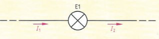
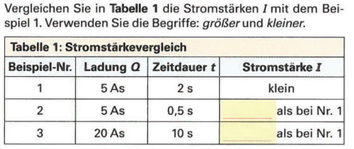
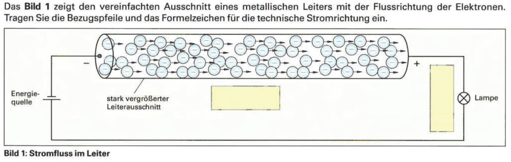
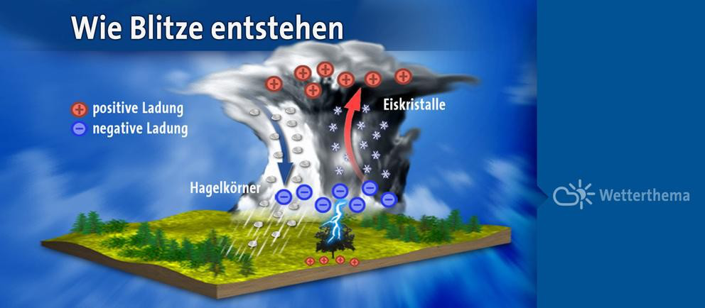

**[Schüler-Skript IT 22]{.ul}**

> **[Kapitel 1.2: Elektr. Strom, Spannung und Widerstand]{.ul}**
>
> **[Kapitel 1.2.1 Elektr. Strom und Spannung in Natur und
> Technik]{.ul}**\
> • **Aufgabe:** Notieren Sie sich je ein Beispiel aus der Natur und aus
> der Technik, welches Sie aus elektrotechnischer Sicht erklären können.
>
> **[Kapitel 1.2.2 Der elektrische Strom]{.ul}**\
> *Hinweis: Alle relevanten Informationen befinden sich in der
> „et-stun.de".*
>
> **(a)** Nennen Sie einen Grund, warum Metalle in der Regel
> elektrischen Strom gut leiten.
>
> _Einer der Hauptgründe, warum Metalle in der Regel elektrischen Strom gut leiten, ist ihre Fähigkeit, freie Elektronen zu transportieren. In Metallen gibt es eine Vielzahl von freien Elektronen, die sich frei innerhalb des Metallgitters bewegen können. Wenn ein elektrischer Strom angelegt wird, bewegen sich diese Elektronen entlang des Metalls und tragen so den Strom. Die Fähigkeit eines Materials, Elektronen zu transportieren, wird als elektrischer Leitwert bezeichnet, und Metalle haben in der Regel einen hohen elektrischen Leitwert._
>
> **(b)** Erklären Sie den Unterschied zwischen technischer und
> physikalischer Stromrichtung.
>
> _Der Unterschied zwischen technischer und physikalischer Stromrichtung besteht darin, wie wir den Strom durch einen elektrischen Leiter beobachten und messen. Die technische Stromrichtung bezieht sich auf die Richtung, in der elektrische Ladungen tatsächlich durch einen elektrischen Leiter fließen, während die physikalische Stromrichtung die Richtung beschreibt, in der die elektromagnetische Kraft wirkt, die auf die Ladungen wirkt._
>
> **(c)** Nennen Sie die Bedeutung und Einheit der folgenden
> Formelzeichen:

| •    | Q    |
| ---- | ---- |
|      |      |
| •    | t    |
| ---- | ---- |
|      |      |
| •    | I    |
| ---- | ---- |
|      |      |
_Q ist ein Formelzeichen für die elektrische Ladung. Die Einheit für die elektrische Ladung ist Coulomb (C)._

_t ist ein Formelzeichen für die Zeit. Die Einheit für die Zeit ist Sekunde (s)._

_I ist ein Formelzeichen für den elektrischen Strom. Die Einheit für den elektrischen Strom ist Ampere (A)._

> **(d)** Zeigen Sie den Zusammenhang zwischen Ladung \[Q\], Zeitdauer
> \[t\] und dem elektrischen Strom \[I\].
>
> 
>
> Der elektrische Strom [I] ist definiert als die Ladung [Q], die pro Zeiteinheit durch einen bestimmten Bereich des elektrischen Feldes fließt. 
>
> In dieser Formel steht [I] für den elektrischen Strom in Ampere (A), [Q] für die Ladung in Coulomb (C) und [t] für die Zeitdauer in Sekunden (s). Wenn wir also beispielsweise wissen, dass eine bestimmte Ladung von 5 Coulomb in 10 Sekunden durch einen bestimmten Bereich des elektrischen Feldes fließt.
>
> Hier sehen wir, dass der elektrische Strom in diesem Beispiel 0,5 Ampere beträgt. Wichtig zu beachten ist, dass der elektrische Strom immer von der Ladung, der Zeitdauer und dem Bereich des elektrischen Feldes abhängt, durch den die Ladung fließt._
>
> Seite 1 von 3
>
> **(e)** 3

{width="3.3125in"
height="0.8236111111111111in"}

> **(f)**
>
> {width="4.608333333333333in"
> height="1.9472211286089238in"}
>
> **(g)**

{width="7.5625in"
height="2.397222222222222in"}

> Seite 2 von 3
>
> **[Kapitel 1.2.3 Die elektrische Spannung]{.ul}**\
> {width="5.093055555555556in"
> height="2.376388888888889in"}**(a)** Nennen Sie eine Voraussetzung
> damit laut Text „starke elektrische Spannungen"entstehen.
>
> *Hinweis:* *Alle relevanten Informationen*\
> *befinden sich in der „et-stun.de".*
>
> _Um starke elektrische Spannungen zu erzeugen, ist es notwendig, dass es einen Unterschied in den elektrischen Ladungen zwischen zwei Punkten gibt. Dieser Unterschied kann durch unterschiedliche Materialien, die unterschiedlich leicht oder schwer elektrische Ladungen leiten, oder durch einen Unterschied in der Dichte der elektrischen Ladungen entstehen. Ein Beispiel für die Erzeugung starke elektrischer Spannungen ist das Auftreten von Blitzen, bei denen es zu einer sehr schnellen Ladungstrennung zwischen verschiedenen Teilen der Atmosphäre kommt, die zu hohen elektrischen Spannungen führt._
>
> 
>
> **(b)** Erläutern Sie, welche elektrische Ladung die Hagelkörner und

Eiskristalle haben, nach dem diese zusammengestoßen sind.		

In einer Gewitterwolke entstehen Hagelkörner und Eiskristalle durch den Prozess der Wolkenbildung. Wenn sich Wassertröpfchen in der Wolke bewegen, können sie zusammenstoßen und zusammenkleben, wodurch größere Hagelkörner und Eiskristalle entstehen. Durch die Bewegungen in der Wolke und durch den ständigen Zusammenstoß von Wassertröpfchen und Eiskristallen werden die Hagelkörner und Eiskristalle immer größer.

Während dieser Prozess der Wolkenbildung stattfindet, sammeln sich ungleich verteilte elektrische Ladungen an den Hagelkörnern und Eiskristallen an. Die Hagelkörner und Eiskristalle, die in die Wolke fallen, sind normalerweise negativ geladen, während die Hagelkörner und Eiskristalle, die an der Unterseite der Wolke bleiben, positiv geladen sind. Durch den ständigen Zusammenstoß von Hagelkörnern und Eiskristallen werden die elektrischen Ladungen immer ungleichmäßiger verteilt, was zu einem elektrischen Entladungsvorgang führen kann und letztendlich zum Ausbruch eines Gewitters.		

​		

> **(c)** Geben Sie an, zwischen welchen Bereich der Blitz im gezeigten
> Bild entsteht.

> **(d)** Ist es theoretisch möglich, dass ein Blitz zwischen oder in
> den Wolken auftritt? Begründen Sie Ihre Antwort kurz.

​	Ja, es ist durchaus möglich, dass ein Blitz zwischen oder in Wolken auftritt. Ein Blitz entsteht, wenn sich in einer Wolke oder zwischen zwei Wolken ungleich verteilte elektrische Ladungen anhäufen und es zu einem elektrischen Entladungsvorgang kommt. Diese Entladung kann sowohl innerhalb einer Wolke als auch zwischen zwei Wolken stattfinden, wodurch ein Blitz entstehen kann.

> **(e)** Geben Sie eine Handlungsanweisung an, was zu tun ist wenn Sie
> ein Gewitter im Freien überrascht.

Wenn Sie sich plötzlich in einem Gewitter im Freien befinden, sollten Sie folgende Schritte unternehmen:

1. Suchen Sie sofort Schutz unter einem Dach oder einem anderen geschützten Bereich, wie zum Beispiel einer Unterführung oder einem Wald. Vermeiden Sie es, unter Bäumen Schutz zu suchen, da diese im Gewitter besonders gefährdet sind und von Blitzen getroffen werden können.
2. Wenn Sie keinen Schutz finden können, suchen Sie eine tiefe Mulde oder ein Tal und setzen Sie sich mit angezogenen Beinen hin, um sich so klein wie möglich zu machen. Vermeiden Sie es, auf einem Hügel oder einer Anhöhe zu sitzen, da Sie dort besonders gefährdet sind.
3. Vermeiden Sie es, während des Gewitters Metallgegenstände zu berühren oder Elektronikgeräte zu benutzen. Diese können von Blitzen getroffen werden und Sie können einen elektrischen Schlag erleiden.
4. Warten Sie, bis das Gewitter vorbei ist und es sicher ist, den geschützten Bereich zu verlassen. Verlassen Sie den Schutz erst, wenn es längere Zeit nicht mehr geblitzt und gedonnert hat.
5. Wenn Sie während des Gewitters nass geworden sind, ziehen Sie sich so schnell wie möglich trockene Kleidung an, um sich nicht zu erkälten. Halten Sie sich warm und trinken Sie ausreichend Flüssigkeit, um Dehydrierung zu vermeiden.

> [Quelle 1:]{.ul} Arbeitsblätter Fachkunde Elektrotechnik, Verlag
> Europa-Lehrmittel, 3. Auflage 2018\
> [Quelle 2:]{.ul}
> https://www.hr-fernsehen.de/sendungen-a-z/alle-wetter/online-thema/online-wetterthema-geheimnisvolleblitze,artikel-2450.html
>
> Seite 3 von 3
